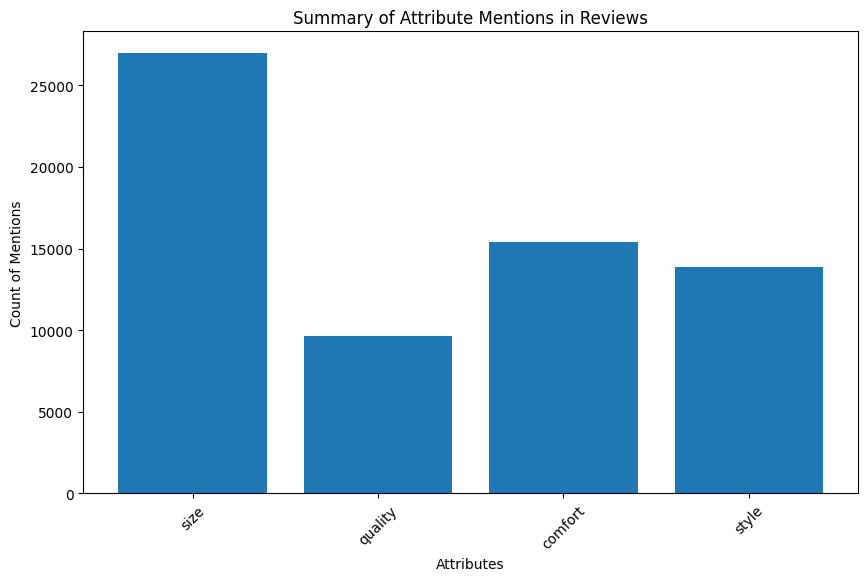
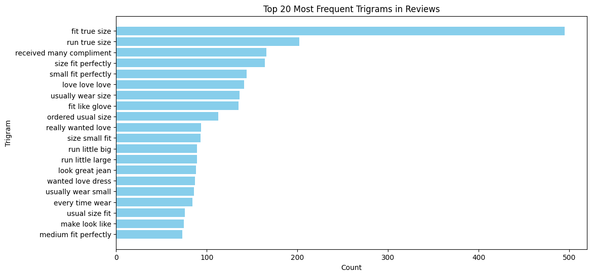

### **KITALULUS TECHNICAL TEXT**

#### **1. Struktur Folder**

```
kitalulus/
├── data/
│   └── Womens Clothing E-Commerce Reviews.csv
├── models/
│   ├── recommendation_model.pkl
│   ├── sentiment_model.pkl
│   └── tfidf_vectorizer.pkl
├── src/
│   ├── components/
│   │   ├── data_ingestion.py
│   │   ├── data_preprocessing.py
│   │   ├── model_trainer.py
│   │   └── __init__.py
│   ├── utils/
│   │   ├── common.py
│   │   ├── logger.py
│   │   ├── exception.py
│   │   └── __init__.py
│   ├── web/
│   │   ├── api/
│   │   │   ├── routes.py
│   │   │   └── __init__.py
│   │   └── streamlit/
│   │       ├── app.py
│   │       └── __init__.py
├── README.md
└── requirements.txt
```

---

#### **2. Installasi Dependensi**

Instal dependensi dengan menjalankan:

```bash
pip install -r requirements.txt
```

---

#### **3. Melatih Model**

Jalankan pipeline model_trainer:

```bash
python src/components/model_trainer.py
```

Pipeline ini akan:

1. Membaca data dari folder `data/`.
2. Membersihkan teks menggunakan **NLTK**.
3. Melakukan transformasi data menggunakan **TF-IDF Vectorizer**.
4. Melatih beberapa model (Random Forest, Logistic Regression, dll.) untuk **rekomendasi** dan **analisis sentimen**.
5. Menyimpan model terbaik di folder `models/`:
   - `recommendation_model.pkl`
   - `sentiment_model.pkl`
   - `tfidf_vectorizer.pkl`

---

#### **4. Menjalankan API**

API berbasis **FastAPI** dapat digunakan untuk prediksi review. Jalankan perintah:

```bash
uvicorn src.web.api.routes:app --reload
```

#### **Endpoint API**

- **URL**: `http://127.0.0.1:8000/predict`
- **Method**: `POST`
- **Request Body**:
  ```json
  {
    "text": "I bought this lovely silk/velvet shirt in the &quot;sky&quot; color but it is more on the teal blue side than sky blue, which disappointed me. it is definitely darker than appears in photo. still a luxurious well-made beauty with sassy appeal. it drapes like a snake slithering down your body. it comes with attitude."
  }
  ```
- **Response**:
  ```json
  {
    "recommendation": true,
    "sentiment": 5,
    "recommendation_confidence": 0.95,
    "sentiment_confidence": 0.87,
    "recommendation_probabilities": {
      "Not Recommended": 0.05,
      "Recommended": 0.95
    },
    "sentiment_probabilities": {
      "Rating 1": 0.02,
      "Rating 2": 0.03,
      "Rating 3": 0.05,
      "Rating 4": 0.15,
      "Rating 5": 0.75
    },
    "cleaned_text": "bought lovely silk velvet shirt quot sky quot color teal blue side sky blue disappointed definitely darker appears photo still luxurious well made beauty sassy appeal drape like snake slithering body come attitude"
  }
  ```

---

#### **5. Menjalankan Dashboard Streamlit**

Untuk menampilkan visualisasi data dan menggunakan prediksi interaktif, jalankan Streamlit:

```bash
streamlit run src/web/streamlit/app.py
```

**Fitur di Streamlit**:

1. **Summary**: Halaman eksplorasi data (EDA).
2. **Prediction**: Masukkan teks ulasan dan dapatkan prediksi.
3. **Model Evaluation**: Evaluasi performa model, termasuk metrik seperti akurasi, precision, recall, F1-score, dll.
4. **Advanced Analysis**: Analisis atribut seperti qaulity, size, comfort, dan topik utama menggunakan LDA.

---

#### **6. Fitur Tambahan**

##### **Analisis Kesalahan (Error Analysis)**

Pada halaman evaluasi, Anda dapat melihat:

- **False Positive**: Review yang salah diprediksi sebagai "Recommended".
- **False Negative**: Review yang salah diprediksi sebagai "Not Recommended".

##### **Pentingnya Fitur**

Anda dapat melihat fitur (kata) mana yang paling berpengaruh pada keputusan model:

- **Recommendation**: Fitur yang penting untuk prediksi rekomendasi.
- **Sentiment**: Fitur yang penting untuk prediksi sentimen.

##### **Model Terbaik**

Pipeline akan memilih model terbaik berdasarkan:

- **F1-Score** dan **Cross-Validation** untuk rekomendasi.
- **Akurasi** dan **RMSE** untuk analisis sentimen.

---


<hr>

# 📊 Customer Feedback Analysis




## 🎯 Key Findings

### Attribute Mentions
```markdown

Faktor Size Dominan: 
Ukuran merupakan atribut yang paling banyak disebutkan dalam review dengan sekitar 27,000 mentions 
Ini menunjukkan bahwa konsumen sangat memperhatikan dan peduli tentang aspek ukuran produk 
Mungkin banyak pembeli yang membahas masalah fitting atau kesesuaian ukuran 


Comfort & Style Seimbang: 
Comfort (kenyamanan) dan style (gaya) memiliki jumlah mentions yang hampir setara, masing-masing sekitar 15,000 mentions 
Ini mengindikasikan bahwa konsumen mementingkan keseimbangan antara kenyamanan dan penampilan
Kedua aspek ini menjadi pertimbangan penting setelah ukuran


Quality Mendapat Perhatian Lebih Rendah: 
Quality memiliki mentions terendah, sekitar 9,000

Ini bisa mengindikasikan beberapa hal: 
Konsumen mungkin lebih fokus pada aspek yang langsung terlihat/terasa
Kualitas produk mungkin sudah cukup baik sehingga tidak terlalu dibahas 
Atau sebaliknya, konsumen kurang memperhatikan aspek kualitas 


Rekomendasi untuk Bisnis: 

Fokus pada sizing yang tepat dan konsisten karena ini adalah concern utama konsumen 
Mempertahankan keseimbangan antara aspek kenyamanan dan gaya 
Meskipun kualitas kurang dibahas, tetap penting untuk dijaga 
Mungkin perlu edukasi konsumen tentang aspek kualitas produk 


Prioritas Konsumen: 
Urutan prioritas konsumen berdasarkan mentions: 

Faktor Ukuran (Size) Dominan:
- Ukuran merupakan atribut yang paling banyak disebutkan dalam review dengan sekitar 27,000 mentions
- Ini menunjukkan bahwa konsumen sangat memperhatikan dan peduli tentang aspek ukuran produk
- Mungkin banyak pembeli yang membahas masalah fitting atau kesesuaian ukuran

comfort & style Seimbang:
- Comfort (kenyamanan) dan style (gaya) memiliki jumlah mentions yang hampir setara, masing-masing sekitar 15,000 mentions
- Ini mengindikasikan bahwa konsumen mementingkan keseimbangan antara kenyamanan dan penampilan
- Kedua aspek ini menjadi pertimbangan penting setelah ukuran

Quality Mendapat Perhatian Lebih Rendah:
- Quality (kualitas) memiliki mentions terendah, sekitar 9,000
- Ini bisa mengindikasikan beberapa hal:
  * Konsumen mungkin lebih fokus pada aspek yang langsung terlihat/terasa
  * Kualitas produk mungkin sudah cukup baik sehingga tidak terlalu dibahas
  * Atau sebaliknya, konsumen kurang memperhatikan aspek kualitas

Rekomendasi untuk Bisnis:
- Fokus pada sizing yang tepat dan konsisten karena ini adalah concern utama konsumen
- Mempertahankan keseimbangan antara aspek kenyamanan dan gaya
- Meskipun kualitas kurang dibahas, tetap penting untuk dijaga
- Mungkin perlu edukasi konsumen tentang aspek kualitas produk

Prioritas Konsumen:
- Urutan prioritas konsumen berdasarkan mentions:
  1. Size
  2. Comfort
  3. Style
  4. Quality
```

### Topics



```
Ukuran sangat penting bagi pembeli. Trigram terkait ukuran seperti "fit true size", "run true size", "size fit perfectly", dan "small fit perfectly" sering muncul, menunjukkan pentingnya kecocokan ukuran produk. <br>

Pembeli sangat memperhatikan komplimen yang mereka terima. "received many compliment" berada di urutan kedua, mengindikasikan konsumen senang saat orang lain memuji produk yang mereka beli. <br>

Kualitas adalah faktor kunci. Trigram seperti "love love love" dan "usually wear size" menandakan kepuasan konsumen dengan kualitas dan kesesuaian produk. <br>

Kenyamanan juga menjadi perhatian. "fit like glove" dan "look great jean" menunjukkan konsumen menghargai produk yang pas, nyaman dipakai dan tampak bagus. <br>

Konsumen memiliki preferensi ukuran tertentuBerdasarkan grafik di atas yang menunjukkan 20 trigram paling sering muncul dalam ulasan, beberapa insight yang dapat diperoleh dalam Bahasa Indonesia adalah: <br>

1. Ukuran sangat penting bagi pembeli. Trigram terkait ukuran seperti "fit true size", "run true size", "size fit perfectly", dan "small fit perfectly" sering muncul, menunjukkan pentingnya kecocokan ukuran produk.

2. Pembeli sangat memperhatikan komplimen yang mereka terima. "received many compliment" berada di urutan kedua, mengindikasikan konsumen senang saat orang lain memuji produk yang mereka beli.

3. Kualitas adalah faktor kunci. Trigram seperti "love love love" dan "usually wear size" menandakan kepuasan konsumen dengan kualitas dan kesesuaian produk.

4. Kenyamanan juga menjadi perhatian. "fit like glove" dan "look great jean" menunjukkan konsumen menghargai produk yang pas, nyaman dipakai dan tampak bagus.

5. Konsumen memiliki preferensi ukuran tertentu. "usually wear small" dan "every time wear" mengindikasikan pembeli cenderung setia pada ukuran yang biasa mereka kenakan.

Secara keseluruhan, ulasan menunjukkan pentingnya keakuratan ukuran, kualitas produk, kenyamanan pemakaian, dan pujian dari orang lain dalam menentukan kepuasan konsumen pada produk fashion yang mereka beli.. "usually wear small" dan "every time wear" mengindikasikan pembeli cenderung setia pada ukuran yang biasa mereka kenakan.

```